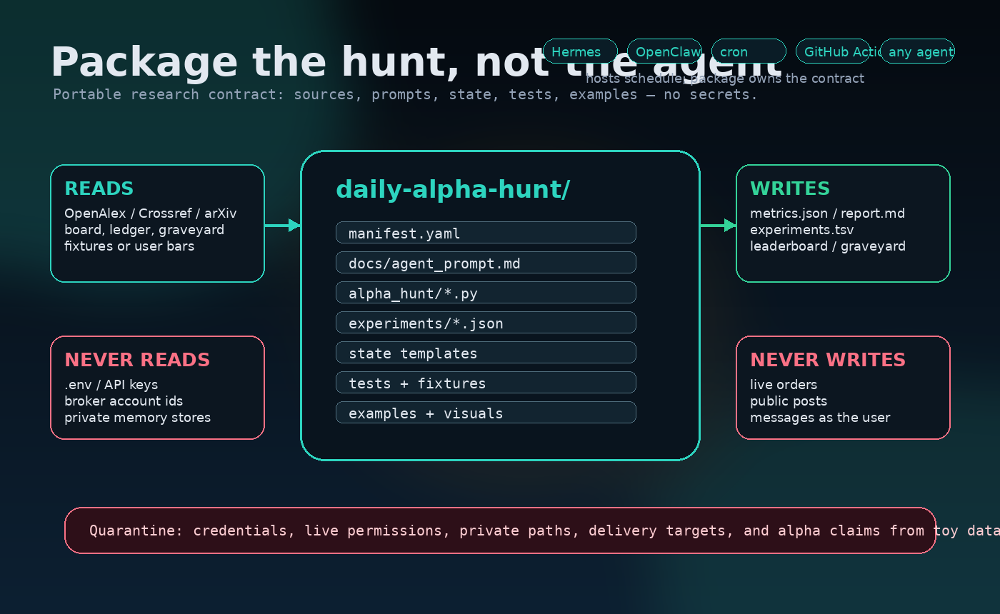
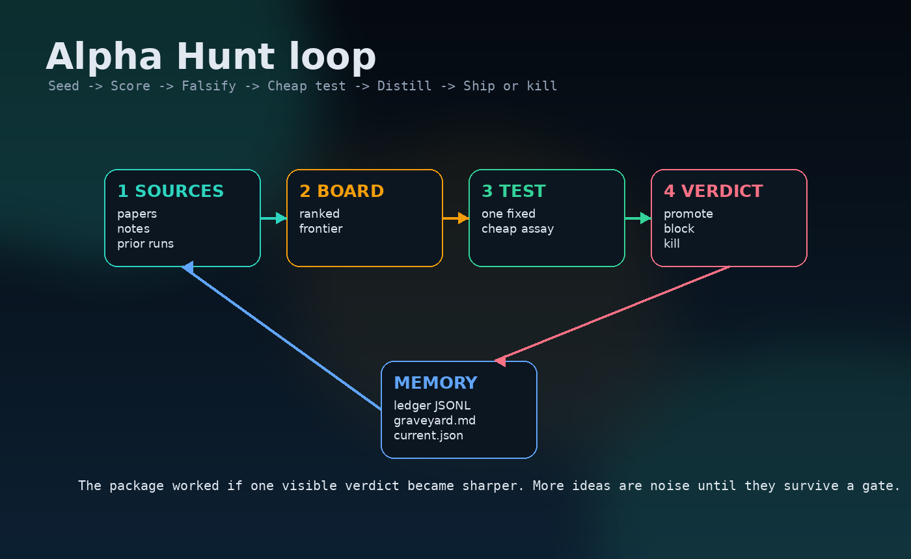
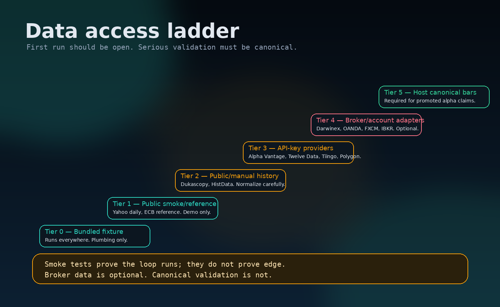
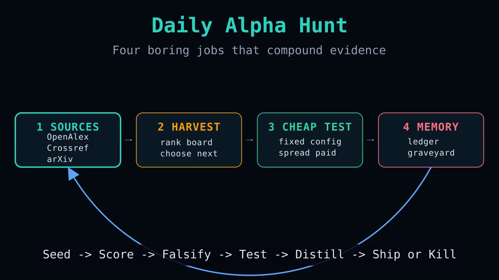
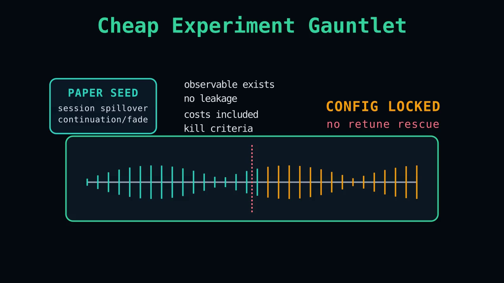

# Alpha Hunt Kit

Package the hunt, not the agent.

Alpha Hunt Kit is a small, offline-first research loop that any coding agent can run:

1. read outside ideas and existing state,
2. form one killable hypothesis,
3. run one cheap bounded experiment,
4. promote, block, or bury the result,
5. write the verdict where tomorrow's agent cannot forget it.

It does **not** trade. It does **not** ship credentials. It does **not** promise edge.
It packages the discipline around alpha research: source -> score -> falsify -> test -> distill -> ship or kill.



## Quick start

```bash
git clone https://github.com/<owner>/alpha-hunt-kit.git
cd alpha-hunt-kit
python3 -m venv .venv
source .venv/bin/activate
python -m pip install -U pip
pip install -e ".[dev]"

alpha-hunt init --demo
alpha-hunt run experiments/baseline.json --data fixtures/bars/demo_ohlcv.csv
alpha-hunt trial experiments/current.json --data fixtures/bars/demo_ohlcv.csv --budget-seconds 30
alpha-hunt status
pytest -q
```

Expected result: a local `.alpha-hunt/runs/<run_id>/` directory with `metrics.json` and `report.md`, plus updated rows in `state/experiments.tsv`.

## The loop



The public package is deliberately boring:

- `prompts/` and `docs/agent_prompt.md`: copy-paste instructions for agents.
- `alpha_hunt/`: tiny CLI and deterministic offline backtest.
- `experiments/`: editable JSON configs.
- `fixtures/`: no-account test data and seed-source examples.
- `state/`: board/current/ledger/graveyard templates.
- `tests/`: public-release guardrails.
- `assets/` and `visuals/`: diagrams plus Manim source for explainers.

## What ships vs what stays outside

| Ships | Stays outside |
| --- | --- |
| scripts, prompts, fixtures, tests, examples | `.env`, API keys, broker IDs |
| state templates and schemas | live trading permissions |
| optional adapter interfaces | private machine paths |
| local dry-run reports | private memory / chat delivery targets |

## Data access ladder



The first run uses committed fixture data. Public feeds and API-key providers are optional adapters. Broker/account-gated data is never required for the demo. Serious promoted claims require the user's own canonical data with timestamp, spread, symbol, and missing-bar semantics documented.

## Run it with an agent

Copy `docs/agent_prompt.md` into your agent, or run:

```bash
AGENT_CMD="<your-agent-cli>" scripts/run_agent_loop.sh
```

The prompt tells the agent to inspect the state, propose one hypothesis, make one minimal change, run the cheap trial, then promote or bury the result.

## Safety boundary

- Dry-run only by default.
- No network required for tests.
- No broker SDK required.
- No secrets in repo or artifacts.
- No "validated alpha" language from fixture or smoke data.
- Failed ideas go to the graveyard instead of being silently rediscovered.

## Visual explainers

Rendered Manim clips are included so the project page is not just prose.

[](assets/videos/alpha-hunt-four-loop-orbit.mp4)

Four Loop Orbit: the daily cycle from sources to board, cheap test, and memory.

[](assets/videos/alpha-hunt-cheap-experiment-gauntlet.mp4)

Cheap Experiment Gauntlet: a paper seed becomes a fixed-config test, then a promote/block/kill verdict.

Manim source lives in `visuals/manim_alpha_hunt.py`.

Render after installing visual extras:

```bash
pip install -e ".[visuals]"
manim -qm visuals/manim_alpha_hunt.py AlphaHuntFourLoopOrbit --media_dir .manim-media
manim -qm visuals/manim_alpha_hunt.py AlphaHuntCheapExperimentGauntlet --media_dir .manim-media
```

## License

MIT.
